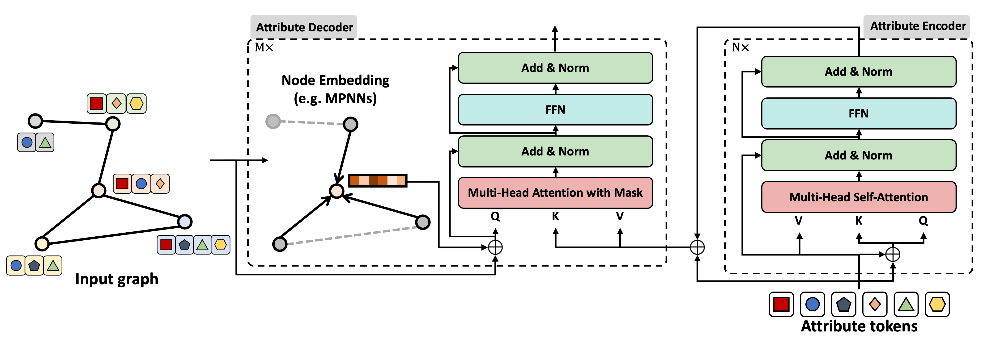

# Node Attribute Transformer (NATR)
> 🚧 **Status:** This repository is being refactored to work seamlessly with the latest PyG (PyTorch Geometric). We expect to finish by **the end of August 2025**.

Official code for the **Node Attribute Transformer (NATR)** from the KDD 2025 paper:

**[Understanding and Tackling Over-Dilution in Graph Neural Networks](https://dl.acm.org/doi/10.1145/3711896.3737168)**

Extended version (will be uploaded on arXiv): 
**[Understanding and Tackling Over-Dilution in Graph Neural Networks](./extended_version.pdf)**

NATR mitigates **over-dilution** in GNNs by (1) dynamically weighting attribute tokens (intra-node) and (2) preserving node-specific signals during propagation (inter-node), via a transformer-style **Attribute Encoder → Attribute Decoder** that plugs into standard GNN backbones.



---

## Table of Contents
- [Overview](#overview)
- [Key Features](#key-features)
- [Installation](#installation)
- [Datasets](#datasets)
- [Usage](#usage)
  - [Node Classification](#node-classification)
  - [Link Prediction](#link-prediction)
  - [Common Arguments](#common-arguments)
- [Project Structure](#project-structure)
- [Citation](#citation)
- [Notes](#notes)

---

## Overview
**Over-dilution** describes the loss of attribute-level information within a single GNN layer and the fading of node-specific signals across layers. NATR treats **node attributes as tokens**, learns their correlations with an **Attribute Encoder (MHSA)**, and fuses them with graph context via an **Attribute Decoder (cross-attention to attributes, message passing for nodes)**. The module can be used as a **full model (`NATR`)** or a **plug-in (`NATR_plug`)** on top of existing backbones.

---

## Key Features
- **Attribute-aware tokenization:** Attend to important attributes per node and context.
- **Two-stage design:** Attribute **Encoder** (self-attention) + Attribute **Decoder** (cross-attention to attributes + GNN).
- **Backbone-agnostic:** Works with common GNNs (e.g., GCN, SAGE, GAT, GATv2, SGC, ARMA, Graphormer, GCNII, PNA*).
- **Plug-in variant:** Drop-in enhancement for existing trained pipelines (`NATR_plug`).

\* Availability of some backbones varies by task script; see `--NATR_GNN` choices.

---

## Installation

> We recommend Python 3.9+ and a CUDA-compatible PyTorch/PyG installation.

```bash
# 1) (Optional) create a clean environment
python -m venv .venv
source .venv/bin/activate  # Windows: .venv\Scripts\activate

# 2) Install core dependencies
pip install -r requirements.txt
````

**Notes**

* Install **PyTorch** and **PyG** versions matching your CUDA/toolchain. If `pip install -r requirements.txt` does not resolve binaries for your platform, install PyTorch & PyG from their official instructions, then re-run the requirements install.
* The OGB DDI tasks require **RDKit** (listed in `requirements.txt`).

---

## Datasets

Supported dataset names (case-insensitive):

* **Amazon:** `computers`, `photo`
* **CitationFull/Planetoid:** `cora_ml`
* **OGB DDI:** `ogbl-ddi-subset`, `ogbl-ddi-full`

The scripts will:

* Use PyG datasets for Amazon/CitationFull.
* Use **OGB** to download `ogbl-ddi`.
  For `ogbl-ddi-*`, the code expects/create files under `./dataset/ogbl_ddi/`. RDKit is used to compute fingerprints.

> If you use DrugBank-derived CSVs, place them under `./dataset/drugbank/` as referenced in the code (e.g., `structure links.csv`, `drugbank vocabulary.csv`).

---

## Usage

### Node Classification

```bash
python node_pred.py \
  --data photo \
  --model NATR \
  --NATR_GNN GCN \
  --use_node_feat \
  --use_attribute
```

### Link Prediction

```bash
python link_pred.py \
  --data ogbl-ddi-full \
  --model NATR \
  --NATR_GNN GCN \
  --use_attribute \
  --batch_size 65536 \
  --lr 0.001
```

> Replace `--data` with one of: `computers`, `photo`, `cora_ml`, `ogbl-ddi-subset`, `ogbl-ddi-full`.

### Common Arguments

* **Modeling**

  * `--model {NATR,NATR_plug}`: full or plug-in variant.
  * `--NATR_GNN {MLP,GCN,SAGE,GAT,GATV2,SGC,ARMA,GraphUNet,PNA,GCNII,Graphormer}`: backbone (set may differ by script).
  * `--num_layers`, `--hidden_channels`, `--heads` (for GAT), `--dropout`.
  * `--num_layers_encoder`, `--num_layers_decoder`, `--FFN_dim`.
  * `--use_attribute`, `--use_node_feat`.
* **Optimization**

  * `--lr`, `--weight_decay`, `--epochs`, `--eval_steps`, `--seed`.
  * Link prediction extras: `--batch_size`, `--eval_batch_size`, `--link_method {cat,add,sub,mul,non-NN}`, `--temperature`.
* **DDI (fingerprint)**

  * `--fpSize` (default 1024), `--radius` (default 3).
* **Misc**

  * `--device` (GPU id), `--use_wandb`, `--exp_name`, `--run_name`, `--test_only`, `--from_scratch`.

---

## Project Structure

```
.
├── link_pred.py           # Link prediction runner
├── node_pred.py           # Node classification runner
├── model.py               # NATR / NATR_plug and backbones
├── ogb_data.py            # Dataset & OGB handling utilities
├── logger.py              # Logging helpers
├── utils.py               # Training / evaluation utilities
└── requirements.txt
```

---

## Citation

If you find this repository helpful, please cite:

```bibtex
@inproceedings{lee2025overdilution,
  title     = {Understanding and Tackling Over-Dilution in Graph Neural Networks},
  author    = {Junhyun Lee and Veronika Thost and Bumsoo Kim and Jaewoo Kang and Tengfei Ma},
  booktitle = {Proceedings of the 31st ACM SIGKDD Conference on Knowledge Discovery and Data Mining (KDD)},
  year      = {2025},
  address   = {Toronto, Canada}
}
```

or

```bibtex
@inproceedings{10.1145/3711896.3737168,
author = {Lee, Junhyun and Thost, Veronika and Kim, Bumsoo and Kang, Jaewoo and Ma, Tengfei},
title = {Understanding and Tackling Over-Dilution in Graph Neural Networks},
year = {2025},
isbn = {9798400714542},
publisher = {Association for Computing Machinery},
address = {New York, NY, USA},
url = {https://doi.org/10.1145/3711896.3737168},
doi = {10.1145/3711896.3737168},
abstract = {Message Passing Neural Networks (MPNNs) hold a key position in machine learning on graphs, but they struggle with unintended behaviors, such as over-smoothing and over-squashing, due to irregular data structures. The observation and formulation of these limitations have become foundational in constructing more informative graph representations. In this paper, we delve into the limitations of MPNNs, focusing on aspects that have previously been overlooked. Our observations reveal that even within a single layer, the information specific to an individual node can become significantly diluted. To delve into this phenomenon in depth, we present the concept of Over-dilution and formulate it with two dilution factors: intra-node dilution for attribute-level and inter-node dilution for node-level representations. We also introduce a transformer-based solution that alleviates over-dilution and complements existing node embedding methods like MPNNs. Our findings provide new insights and contribute to the development of informative representations. The implementation and supplementary materials are publicly available at https://github.com/LeeJunHyun/NATR.},
booktitle = {Proceedings of the 31st ACM SIGKDD Conference on Knowledge Discovery and Data Mining V.2},
pages = {1253–1261},
numpages = {9},
keywords = {graph neural networks, node attribute, over-dilution},
location = {Toronto ON, Canada},
series = {KDD '25}
}
```

---

## Notes

* **Refactoring / PyG compatibility:** We are actively updating for the latest PyG; breaking changes may occur until the end of **August 2025**.
* **Reproducibility:** Use `--seed` to fix randomness. Some dataset preprocess steps (e.g., RDKit fingerprints) may introduce environment-specific variation.
* **Issues & PRs:** Contributions and bug reports are welcome once the refactor stabilizes.
